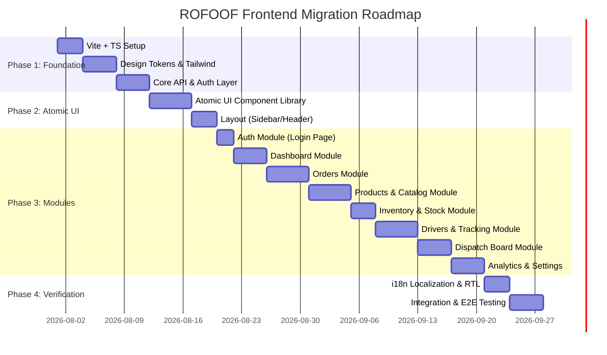
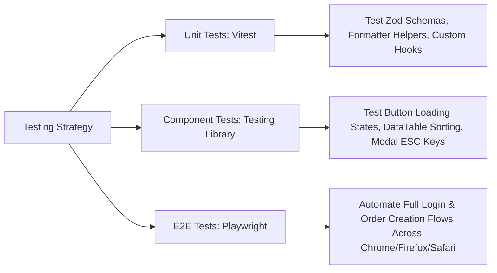

# Refactor Plan: ROFOOF Dashboard Architecture Migration

This document establishes the strategic refactoring plan, risk assessments, technical debt matrix, folder migration roadmap, testing strategy, and rollback procedures for migrating the legacy HTML/CSS/JS ROFOOF site into a modern React 19 / TypeScript application.

---

## 1. Technical Debt Inventory

| Category | Risk Level | Debt Description | Refactoring Priority | Impact on Business |
|---|---|---|---|---|
| **Security & Auth** | 🔴 HIGH | Hardcoded credentials in `login.html`, insecure `sessionStorage` boolean check, lack of JWT token refresh. | Priority 1 | Unauthorized access risk, compliance failure. |
| **XSS Vulnerabilities** | 🔴 HIGH | Global `.innerHTML` string assignment in `app.js`, `orders.js`, `modals.js` without escaping. | Priority 1 | Malicious script execution, session hijacking. |
| **Code Duplication** | 🟠 MEDIUM | 60+ inline SVG strings duplicated; form CSS styles copied across 4 CSS files; `modals.js` (1241 lines). | Priority 2 | Maintenance bloat, high bug density on changes. |
| **Global State Mutation** | 🟠 MEDIUM | Window-level data mutation (`ordersData.push()`) without reactive UI re-render triggers. | Priority 2 | Data inconsistencies, UI synchronization bugs. |
| **Accessibility (a11y)** | 🟡 LOW | Non-semantic `div` button tags, missing ARIA attributes, focus trapping bugs in dialog overlays. | Priority 3 | Screen reader incompatibility, poor user experience. |
| **Performance Bloat** | 🟡 LOW | 4.08 MB uncompressed assets (`figma_dashboard.png`, `app_icon.png`), blocking Google Fonts links. | Priority 3 | High mobile initial page load latency. |

---

## 2. Migration Order & Phase Roadmap

---

## 3. Detailed Sprint Breakdown & Effort Estimation

### Phase 1: Project Foundation & Build System Setup (Effort: 11 Person-Days)
- **Step 1.1**: Initialize Vite 6 + React 19 + TypeScript template in root (`npx -y create-vite@latest`).
- **Step 1.2**: Configure Tailwind CSS v4 design tokens (`theme/colors.ts`, `theme/typography.ts`, `theme/spacing.ts`).
- **Step 1.3**: Set up Axios HTTP client, token refresh interceptor, and TanStack Query provider (`core/api/`).
- **Step 1.4**: Configure `i18next` for English LTR and Arabic RTL (`localization/i18n.ts`).

### Phase 2: Shared UI Component Library (Effort: 8 Person-Days)
- **Step 2.1**: Build primitive atomic UI components (`Button`, `Input`, `Select`, `Badge`, `Card`, `Switch`, `Tabs`, `Modal`, `Drawer`).
- **Step 2.2**: Build data components (`DataTable`, `Pagination`, `EmptyState`, `Skeleton`, `Toast`).
- **Step 2.3**: Build shared layout components (`AdminLayout`, `Sidebar`, `Header`, `Breadcrumb`).

### Phase 3: Page-by-Page Feature Migration (Effort: 30 Person-Days)
- **Sprint 3.1: Auth & Login Page** (`modules/auth/`) -> Convert `login.html`.
- **Sprint 3.2: Operations Dashboard** (`modules/dashboard/`) -> Convert `pages/index.html`.
- **Sprint 3.3: Orders Management** (`modules/orders/`) -> Convert `pages/orders.html`.
- **Sprint 3.4: Product Catalog & Categories** (`modules/products/`) -> Convert `pages/products.html` and `pages/categories.html`.
- **Sprint 3.5: Inventory Control** (`modules/inventory/`) -> Convert `pages/stock-overview.html`.
- **Sprint 3.6: Fleet & Live Tracking** (`modules/drivers/`) -> Convert `pages/drivers.html` and `pages/live-tracking.html`.
- **Sprint 3.7: Dispatch Board** (`modules/dispatch/`) -> Convert `pages/dispatch-board.html`.
- **Sprint 3.8: Analytics & Settings** (`modules/analytics/`, `modules/settings/`) -> Convert `pages/analytics.html` and `pages/settings.html`.

### Phase 4: QA, Testing & Hardening (Effort: 7 Person-Days)
- **Step 4.1**: Unit testing custom hooks and Zod schemas using Vitest.
- **Step 4.2**: Component testing using React Testing Library.
- **Step 4.3**: End-to-End (E2E) automation testing key user flows (Login -> Create Order -> Dispatch -> Deliver) using Playwright.

---

## 4. Testing Strategy Matrix

---

## 5. Rollback & Risk Mitigation Strategy

### Dual-Run Parallel Deployment (Zero Downtime Strategy):
1. **Legacy Route Fallback**: Deploy the new React single-page application under sub-path `/app/` while maintaining legacy HTML pages under `/overview-page/`.
2. **Feature Flag Toggles**: Use launch darky / feature flag toggles to route a percentage of admin traffic to the new React app.
3. **Instant Rollback**: If critical defects arise in the React app, update Nginx / CDN routing to revert 100% of traffic to legacy static files within 60 seconds.
