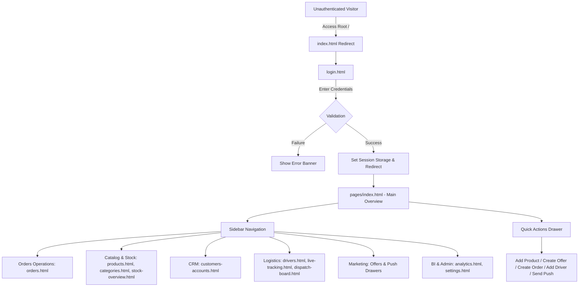
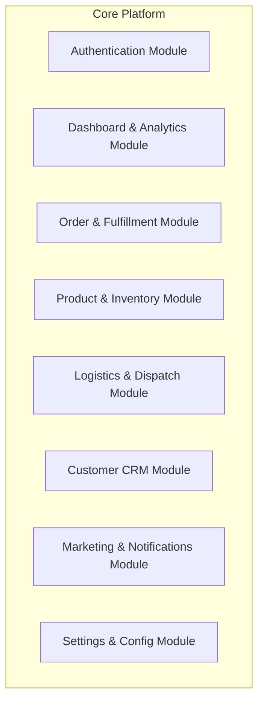

# 01. Project Overview

## 1. Executive Summary
**ROFOOF** is an enterprise-grade Grocery & Delivery Management Platform serving B2B wholesale buyers and B2C retail customers. The current web platform provides administrative management for store operations, inventory tracking, order fulfillment, driver fleet management, real-time dispatching, marketing campaign management, and business analytics.

---

## 2. Platform Purpose & Scope
The platform provides centralized operations management across multiple grocery retail and wholesale channels:
- **Order Fulfillment**: End-to-end processing of orders from placement to live dispatch and customer delivery.
- **Inventory & Catalog Management**: Multi-category product management with step-by-step variant, pricing, and stock configuration.
- **Fleet & Logistics Operations**: Real-time driver fleet tracking, automated/manual dispatch queues, and route monitoring.
- **Customer Relationship Management (CRM)**: Accounts for wholesale B2B client credit tiers and B2C retail shoppers.
- **Marketing & Promotions**: Campaign management for offers, deals, and push notification triggers.
- **Business Intelligence**: Visual analytics for sales metrics, profit margins, driver performance, and delivery timelines.

---

## 3. Comprehensive Pages Inventory

| Page File | Page Title / Purpose | Core Responsibilities |
|---|---|---|
| `login.html` | Authentication Portal | Client login form, session storage guard, platform feature highlights, demo credentials |
| `index.html` (Root) | Entry Redirect | Auto-redirects root visits directly to `login.html` |
| `pages/index.html` | Operations Dashboard | Key metric stat cards with sparklines, mini operational counters, quick action bar, live status alerts |
| `pages/orders.html` | Order Management | Order listing table, state filtering (Active, Pending, Delivered, Cancelled), order creation modal |
| `pages/products.html` | Product Catalog | Master product list, category filtering, search, stock badges, multi-step product creation drawer |
| `pages/categories.html` | Category Hierarchy | Visual tree & card layout for product categories, image upload, sub-category nesting |
| `pages/stock-overview.html` | Inventory Control | Stock levels, low-stock alerts (12 items), out-of-stock indicators (3 items), stock replenishment actions |
| `pages/customers-accounts.html` | Customer Management | Customer accounts (B2B wholesale & B2C retail), credit limit metrics, transaction logs |
| `pages/drivers.html` | Fleet Management | Driver roster, status indicators (online, busy, offline), performance metrics, driver onboarding |
| `pages/live-tracking.html` | Live GPS Tracking | Interactive map visualization for driver positions, active delivery routes, and ETA status |
| `pages/dispatch-board.html` | Dispatch Control Center | Order assignment queue, driver matching, automated route dispatching |
| `pages/analytics.html` | Business Intelligence | Financial charts, sales breakdown, delivery efficiency metrics, customer acquisition graphs |
| `pages/settings.html` | System Configuration | Store information, delivery zones, tax rules, notification toggles, user profile configuration |
| `pages/modals.html` | Component Catalog | Standalone showcase for testing all application quick action modals, drawers, and form dialogs |

---

## 4. User Journey & Navigation Model

### 4.1 User Flow Diagram (Mermaid)

### 4.2 Navigation Architecture
- **Global Left Sidebar**: Injected dynamically by `js/layout.js`. Contains quick action triggers, collapsible multi-level navigation items, badge counters (e.g., Active Orders `164`, Low Stock `12`), and mini admin profile footer.
- **Top Header Bar**: Injected dynamically by `js/layout.js`. Contains search input for quick lookup, live system indicator, notification drop drawer, and user profile avatar.

---

## 5. Core Business Modules

### 5.1 Authentication Module
- **Current implementation**: Single client-side script in `login.html` evaluating hardcoded credentials (`admin@rofoof.com` / `admin123`) and storing string `'true'` under `sessionStorage.getItem('rofoof_logged_in')`.
- **Target architecture**: OAuth2 / JWT bearer authentication with Axios interceptors, refresh token rotation, secure cookie / memory token storage, and RBAC (Role-Based Access Control).

### 5.2 Order & Fulfillment Module
- **Capabilities**: Filter orders across multiple lifecycle states (Pending -> Processing -> Dispatched -> Delivered / Cancelled). Detail drawer displays itemized items, customer address, payment status, and dispatch actions.

### 5.3 Product & Inventory Module
- **Capabilities**: Multi-step wizard (`modals.js`) covering Product Info, Image Uploads, Packaging specs, Stock management, and Tiered B2B/B2C Pricing. Category visual manager with sub-category nesting.

### 5.4 Logistics & Fleet Module
- **Capabilities**: Live GPS tracking dashboard, driver roster management, dispatch board with drag-and-drop or one-click order assignment, auto-dispatch queue, driver status tracking (Available, Busy, Offline).

---

## 6. Page Quality & Architectural Health Scorecard

| Page Name | Maintainability | Performance | Accessibility | Responsiveness | Code Quality | Reusability | Overall Score |
|---|---|---|---|---|---|---|---|
| `login.html` | 5/10 | 8/10 | 6/10 | 6/10 | 5/10 | 3/10 | **5.5/10** |
| `pages/index.html` | 4/10 | 6/10 | 4/10 | 5/10 | 4/10 | 4/10 | **4.5/10** |
| `pages/orders.html` | 5/10 | 7/10 | 5/10 | 6/10 | 5/10 | 5/10 | **5.5/10** |
| `pages/products.html` | 4/10 | 6/10 | 4/10 | 5/10 | 4/10 | 5/10 | **4.7/10** |
| `pages/categories.html` | 5/10 | 7/10 | 5/10 | 6/10 | 5/10 | 4/10 | **5.3/10** |
| `pages/stock-overview.html` | 6/10 | 7/10 | 5/10 | 6/10 | 5/10 | 5/10 | **5.7/10** |
| `pages/customers-accounts.html` | 6/10 | 7/10 | 5/10 | 6/10 | 5/10 | 5/10 | **5.7/10** |
| `pages/drivers.html` | 5/10 | 7/10 | 4/10 | 5/10 | 4/10 | 5/10 | **5.0/10** |
| `pages/live-tracking.html` | 4/10 | 5/10 | 3/10 | 4/10 | 4/10 | 3/10 | **4.2/10** |
| `pages/dispatch-board.html` | 4/10 | 6/10 | 4/10 | 5/10 | 4/10 | 4/10 | **4.5/10** |
| `pages/analytics.html` | 5/10 | 6/10 | 4/10 | 5/10 | 4/10 | 4/10 | **4.7/10** |
| `pages/settings.html` | 5/10 | 7/10 | 5/10 | 6/10 | 5/10 | 4/10 | **5.3/10** |
| `pages/modals.html` | 3/10 | 5/10 | 3/10 | 4/10 | 3/10 | 3/10 | **3.5/10** |

### Score Explanations:
- **Maintainability (4.7/10 avg)**: HTML files rely on string-concatenated JS layout injection (`layout.js`) and huge 1200+ line modal injection scripts (`modals.js`).
- **Performance (6.4/10 avg)**: External Google Fonts and embedded SVG strings, but lack of code splitting, asset bundle management, or image format optimization.
- **Accessibility (4.5/10 avg)**: Missing ARIA attributes, hardcoded non-semantic `
` buttons, lack of focus trap management in modals.
- **Responsiveness (5.3/10 avg)**: Responsive rules rely on standard `max-width: 768px` queries, missing granular breakpoint support for mobile/tablet screen sizes.
