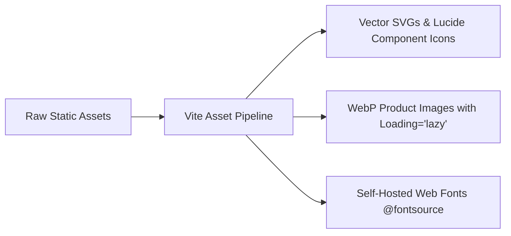

# 03. Assets Analysis

This document audits all static and dynamic media assets in the ROFOOF repository, identifying optimization bottlenecks, duplicate usages, and migration strategies for the target React architecture.

---

## 1. Static Image Files Audit

| Asset Path | Format | Size | Resolution / Purpose | Optimization Finding | Action Required |
|---|---|---|---|---|---|
| `overview-page/img/logo.png` | PNG | **272 KB** | ~400x400 Brand Logo | Uncompressed raster logo. Unnecessary payload for a simple vector brand icon. | Convert to optimized inline SVG or Lucide React component (< 2 KB). Save 99.2% payload. |
| `overview-page/img/app_icon.png` | PNG | **856 KB** | ~1024x1024 App Favicon / Icon | Uncompressed high-res PNG used as a 32x32 favicon! | Convert to standard `.ico` / vector `.svg` favicon. Save 99.8% payload. |
| `logo.png` (Root) | PNG | **272 KB** | Duplicate of `overview-page/img/logo.png` | Redundant duplicate asset in root directory. | Delete root duplicate; manage assets via Vite build pipeline. |
| `app_icon.png` (Root) | PNG | **856 KB** | Duplicate of `overview-page/img/app_icon.png` | Redundant duplicate asset in root directory. | Delete root duplicate. |
| `figma_dashboard.png` (Root) | PNG | **2.69 MB** | Design mockup export | Reference design file committed directly in workspace root. | Exclude from production bundle; store in design archives. |

---

## 2. Inline SVG Icons Inventory

The codebase currently hardcodes over 60 SVG icon strings across JavaScript files (`layout.js`, `app.js`, `modals.js`, `orders.js`, `products.js`).

### Duplication & Anti-Pattern Analysis:
- **Order Icon**: `viewBox="0 0 24 24" fill="none" stroke="currentColor"` defined identically in `layout.js:40`, `app.js:28`, `modals.js:118`, `orders.js:14`.
- **Truck / Delivery Icon**: Defined separately in 5 different files with minor inline style overrides.
- **Users / Customer Icon**: Duplicate SVG definitions in `layout.js:56`, `layout.js:59`, `app.js:33`.
- **Clock / Pending Icon**: Duplicate SVG string in `layout.js:63`, `app.js:35`, `app.js:38`.

### Optimization Opportunity:
Migrate all raw SVG strings to **Lucide React** icon components (`<Package />`, `<ShoppingBag />`, `<Truck />`, `<Users />`, `<Search />`, `<Bell />`, `<CheckCircle />`, `<ChevronDown />`).
- **Benefits**: Zero DOM string parsing, full TypeScript autocomplete, automatic tree-shaking, unified sizing and stroke-width props.

---

## 3. Fonts & Typography Assets

- **Current Loading Method**:
  ```html
  <link href="https://fonts.googleapis.com/css2?family=Inter:opsz,wght@14..32,400;14..32,500;14..32,600;14..32,700&display=swap" rel="stylesheet">
  ```
- **Performance Risk**: Blocking third-party render overhead. If Google Fonts CDN experiences latency, page rendering blocks.
- **Migration Strategy**:
  - Use `@fontsource/inter` npm package for self-hosting Inter fonts within the Vite bundle.
  - Apply `font-display: swap` in the global CSS token layer.
  - Implement system font fallbacks: `font-family: 'Inter', -apple-system, BlinkMacSystemFont, 'Segoe UI', Roboto, sans-serif`.

---

## 4. Lazy Loading & Asset Delivery Strategy



1. **Product & Category Images**: Replace static PNG placeholdings with dynamic WebP images loaded via lazy loading (`loading="lazy"` attribute or React `<Image>` component with Blur-up placeholders).
2. **Bundle Impact**:
   - Current Asset Footprint: **~4.08 MB**
   - Target Optimized Footprint: **< 150 KB** (Savings of **96.3%**).
