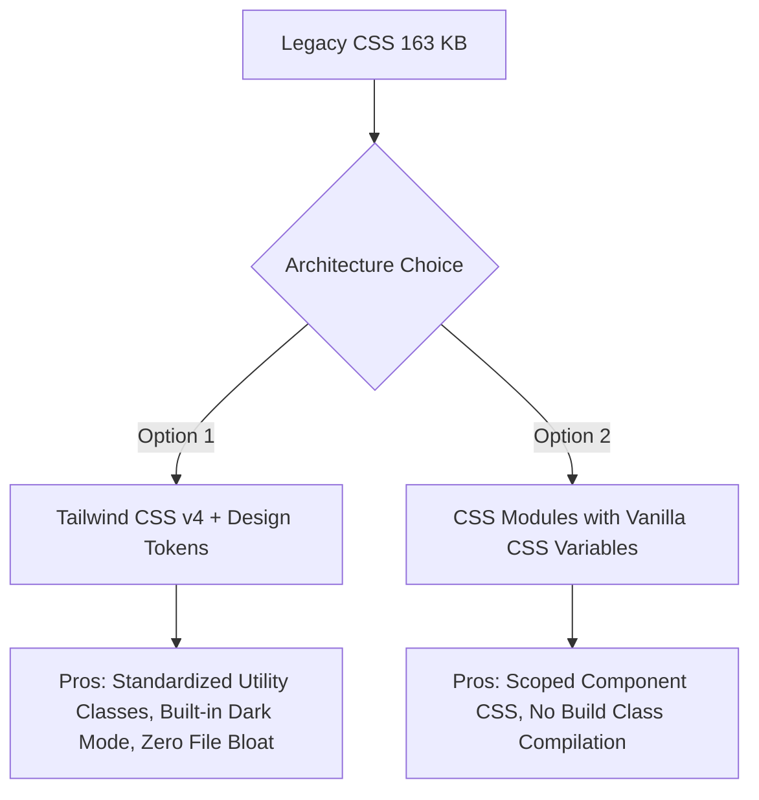

# 04. CSS Analysis

This document provides an architecture-level audit of all 12 CSS files in the project, detailing style duplication, token inconsistencies, responsive gaps, and CSS migration options.

---

## 1. CSS Files Overview & Footprint

| CSS File | Size | Primary Responsibility | Critical Findings |
|---|---|---|---|
| `css/index.css` | **46.2 KB** | Global styles, CSS variables, layout grid, sidebar, header, stat cards | Contains massive global styling rules mixed with component-specific overrides. |
| `css/products.css` | **20.3 KB** | Product catalog grid, multi-step stepper, product filter bar | Duplicate form input styles and modal overlay CSS identical to `index.css`. |
| `css/orders.css` | **18.7 KB** | Order table, detail drawer, status badge colors | Duplicate table styles; status badge classes conflict across pages. |
| `css/categories.css` | **18.4 KB** | Category cards, hierarchy tree, subcategory pills | Hardcoded grid widths and fixed pixel paddings. |
| `css/dispatch-board.css` | **11.9 KB** | Dispatch board columns, assignment queue cards | Ad-hoc z-index values (`999`, `10000`). |
| `css/settings.css` | **10.2 KB** | Settings tab container, form sections, switch toggles | Hardcoded input heights and absolute positioned toggles. |
| `css/drivers.css` | **7.3 KB** | Driver card grid, driver status badges | Duplicated badge color tokens. |
| `css/live-tracking.css` | **6.2 KB** | Simulated map grid, route panel | Fixed height map container causing overflow on mobile. |
| `css/customers-accounts.css` | **5.6 KB** | Customer table, credit balance badges | Redundant table cell styling. |
| `css/stock-overview.css` | **5.4 KB** | Inventory KPI row, low-stock table | Duplicate alert pill CSS. |
| `css/notifications.css` | **4.6 KB** | Notification dropdown drawer, alert badges | Fixed positioning bugs on mobile screens. |
| `css/analytics.css` | **3.5 KB** | Analytics card container, chart legend | Hardcoded grid gaps. |

---

## 2. Color Palette & Token Analysis

### Current CSS Variables (`index.css` & `login.html`):
```css
:root {
  --brand: #384E85;
  --brand-dark: #2A3A65;
  --text: #0F1629;
  --text2: #7A8299;
  --bg: #FAFAFA;
  --white: #FFFFFF;
  --border: rgba(56,78,133,0.08);
  --radius: 11px;
  --green: #10B981;
}
```

### Critical Token Flaws:
1. **Ad-hoc Hex Colors**: Color values like `#10B981`, `#F59E0B`, `#8B5CF6`, `#F97316`, `#EC4899`, `#06B6D4` are hardcoded directly into JS sparklines and page CSS files rather than governed by central variables.
2. **Opacity Inconsistencies**: Border transparencies mix `rgba(56,78,133,0.08)`, `rgba(56,78,133,0.07)`, `rgba(0,0,0,0.06)`, and `rgba(0,0,0,0.1)`.
3. **Dark Mode Absence**: Hardcoded `#FAFAFA` and `#FFFFFF` make theme switching impossible without complete refactoring.

---

## 3. Typography & Spacing System Audit

- **Font Sizes**: Random pixel measurements used throughout (`11px`, `12px`, `13px`, `14px`, `15px`, `16px`, `18px`, `22px`, `26px`, `28px`). Missing modular type scale (rem/em).
- **Line Heights**: Mixed unitless line heights (`1.5`, `1.7`) with explicit pixel heights (`height: 44px; line-height: 44px;`).
- **Spacing**: Margins and paddings use arbitrary values (`6px`, `8px`, `10px`, `12px`, `14px`, `16px`, `20px`, `24px`, `32px`, `40px`) instead of an 8pt architectural grid scale (4, 8, 12, 16, 24, 32, 48, 64px).

---

## 4. Z-Index Management & Overlay Anti-Patterns

- **Ungoverned Z-Indexes**:
  - Sidebar: `z-index: 100;`
  - Header: `z-index: 90;`
  - Notifications Drawer: `z-index: 1000;`
  - Modal Overlay: `z-index: 9999;`
  - Modal Dropdown: `z-index: 10000;`
- **Risk**: Stacking context collisions where dropdowns pop under modal overlays or slide-out drawers.

---

## 5. Duplicated Styles & Anti-Patterns

1. **Form Input Duplication**: `.form-input`, `.form-select`, `.form-textarea` are redefined with minor variations across `index.css`, `login.html`, `products.css`, and `settings.css`.
2. **Badge Duplication**: Badge classes (`.badge`, `.badge-status`, `.stat-change-pill`) are defined independently in 6 CSS files.
3. **Hardcoded Heights**: Frequent use of `height: 44px`, `height: 46px`, `height: 300px` causing text truncation and container overflow on dynamic content insertion.

---

## 6. Migration Strategy: Tailwind CSS vs CSS Modules



### Recommendation: **Tailwind CSS v4 with Custom Theme Token Configuration**
- Tailwind CSS standardizes spacing, colors, breakpoints, typography, and z-index layers.
- Paired with `clsx` and `tailwind-merge` for dynamic component styling (`cn(...)` utility).
