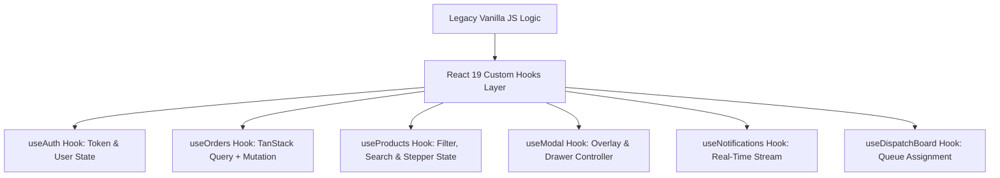

# 05. JavaScript Analysis

This document provides a deep architectural analysis of all 9 JavaScript files in the current repository, evaluating state management, DOM manipulation, authentication, global scope pollution, and opportunities to refactor into idiomatic React 19 Custom Hooks.

---

## 1. JavaScript Files Inventory & Footprint

| JS File | Size | Primary Functionality | Core Issues Identified |
|---|---|---|---|
| `js/modals.js` | **63.4 KB** | Self-contained HTML string injection for 5 global modals and drawers | Massive string concatenation (1241 lines), inline `onclick` handlers, lack of state isolation. |
| `js/app.js` | **30.8 KB** | Dashboard KPI rendering, SVG sparkline generator, stats mock data | Imperative DOM updates (`innerHTML = ...`), global variables (`stats`, `miniStats`, `icons`). |
| `js/orders.js` | **23.4 KB** | Order filtering, order drawer rendering, status updates | Mutates global arrays directly; state stored in global window object. |
| `js/categories.js` | **20.3 KB** | Category list rendering, subcategory tree toggles | Global event listeners attached without cleanup logic. |
| `js/products.js` | **16.0 KB** | Product catalog table rendering, search filtering | Duplicate SVG icon generation logic; imperative filtering. |
| `js/layout.js` | **14.6 KB** | Sidebar & header DOM injection, session auth guard, quick actions | IIFE injecting raw HTML strings into DOM placeholders (`#sidebar-placeholder`). |
| `js/notifications.js` | **8.0 KB** | Notification panel toggle, unread counter management | Global event handlers attached to document object. |
| `js/dispatch-board.js` | **7.8 KB** | Dispatch queue assignment, driver matching | Manual DOM nodes creation without virtual DOM diffing. |
| `js/settings.js` | **5.2 KB** | Settings tab switching, profile form save | Handled via direct style mutation (`element.style.display = 'block'`). |

---

## 2. Global Scope Pollution & Mutability Audit

### Global Variables Declared on `window`:
- `stats`, `miniStats`, `icons` in `app.js`
- `ordersData`, `activeOrderTab`, `selectedOrderId` in `orders.js`
- `productsData`, `categoriesData` in `products.js` & `categories.js`
- `openAddProductModal()`, `closeAddProductModal()`, `openCreateOfferModal()`, `openCreateOrderModal()`, `openAddDriverModal()`, `openSendNotificationModal()` in `modals.js`
- `toggleQuickActions()`, `toggleSub()`, `toggleNotifications()` in `layout.js` & `notifications.js`

### Architectural Risks:
- **Namespace Collisions**: Functions like `updatePreview()` or `toggleSub()` can be accidentally overridden by any loaded script.
- **State Drift**: Mutating global arrays (`ordersData.push(...)`) fails to trigger UI re-renders reliably without manually calling re-render functions.

---

## 3. DOM Manipulation & Event Listener Analysis

### Imperative String Concatenation:
```javascript
// Pattern found in app.js, layout.js, modals.js, orders.js
grid.innerHTML = stats.map(s => {
  return '<div class="stat-card">...</div>';
}).join('');
```
- **Performance Overhead**: Full DOM destruction and element re-instantiation on every state update.
- **Security Vulnerability**: String concatenation of user inputs without sanitization risks **XSS (Cross-Site Scripting)**.

### Missing Event Cleanup (Memory Leak Risks):
- Document click listeners added in `notifications.js` (`document.addEventListener('click', ...)`):
  If pages are navigated, orphaned event listeners remain in memory.

---

## 4. Storage & Authentication Patterns

- **Session Storage Dependency**:
  ```javascript
  // layout.js & login.html
  if (sessionStorage.getItem('rofoof_logged_in') !== 'true') {
    window.location.replace('../login.html');
  }
  ```
- **Security Flaw**:
  - No expiration timestamp, token signature, or refresh mechanism.
  - Anyone can execute `sessionStorage.setItem('rofoof_logged_in', 'true')` in browser devtools to bypass authentication.

---

## 5. React 19 Custom Hooks Refactoring Strategy



### 1. `useAuth()` Hook
- Manages JWT access token in memory, refresh token in httpOnly cookie.
- Provides `login()`, `logout()`, `user`, `isAuthenticated`, `hasRole()`.

### 2. `useOrders(filters)` Hook
- Replaces imperative order filter logic in `orders.js`.
- Integrates TanStack Query `useQuery(['orders', filters])` for caching, background refetching, and optimistic updates.

### 3. `useProductWizard()` Hook
- Replaces 1200 lines in `modals.js` with structured React Hook Form + Zod schema validation across 5 wizard steps.

### 4. `useModalState()` Hook
- Replaces global modal toggle functions with typed modal state management.
