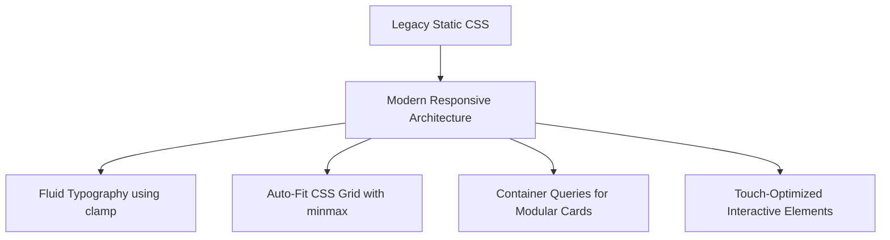

# 08. Responsive Analysis

This document provides a comprehensive responsive design audit across 18 target screen resolutions, identifying layout bugs, overflow triggers, hardcoded dimensions, and touch target violations in the current codebase.

---

## 1. Viewport Testing Matrix

| Breakpoint | Screen Category | Current Layout Behavior | Status | Primary Issues Identified |
|---|---|---|---|---|
| **320px** | Mobile Small | Severe horizontal scrolling; tables overflow viewport | ❌ FAIL | Hardcoded `min-width: 900px` on tables without responsive wrapper. |
| **360px** | Mobile Small | Stat cards clip sparkline SVGs | ❌ FAIL | Fixed padding `32px` reduces content area to < 280px. |
| **375px** | Mobile Medium | Login page right panel hidden, header search overflows | ⚠️ PARTIAL | Header search bar stays fixed at `width: 320px`. |
| **390px** | Mobile Medium | Sidebar collapses but touch target < 44px | ⚠️ PARTIAL | Close icons and sub-nav buttons too small for touch. |
| **414px** | Mobile Large | Stepper dots overlap text in product modal | ❌ FAIL | 5-step horizontal stepper breaks on narrow screens. |
| **480px** | Mobile Extra Large | Stats grid displays 1 card per row with excessive margin | ⚠️ PARTIAL | Inefficient vertical spacing. |
| **576px** | Phablet | Category grid wraps awkwardly | ⚠️ PARTIAL | Fixed 3-column template grid forcing narrow cards. |
| **768px** | Tablet Portrait | Sidebar hides completely; mobile menu toggle missing! | ❌ FAIL | No hamburger mobile drawer implementation in current script. |
| **820px** | Tablet Medium | Header right elements wrap below title | ⚠️ PARTIAL | Flex gap wrap issue in header bar. |
| **992px** | Tablet Landscape | Orders table requires manual horizontal scroll | ⚠️ PARTIAL | Works but lacks sticky action column. |
| **1024px** | Laptop Small | Dashboard stats grid displays 4 cards per row correctly | ✅ PASS | Good visual layout. |
| **1200px** | Desktop Standard | Standard 2-column layout rendered cleanly | ✅ PASS | Clean desktop layout. |
| **1280px** | Desktop Standard | Optimal layout performance | ✅ PASS | Benchmark desktop view. |
| **1366px** | Laptop Common | Optimal layout performance | ✅ PASS | Benchmark laptop view. |
| **1440px** | Desktop Large | Wide margins on right side of dashboard grid | ⚠️ PARTIAL | Max container width uncapped, stretching cards. |
| **1536px** | Desktop Extra Large | High whitespace between main cards and sidebar | ⚠️ PARTIAL | Unbalanced grid column ratios. |
| **1728px** | Mac Studio | High whitespace | ⚠️ PARTIAL | Uncapped container stretch. |
| **1920px** | Full HD Monitor | Over-stretched chart elements and data tables | ⚠️ PARTIAL | Needs max-width container constraints (`max-w-7xl`). |

---

## 2. Hardcoded Dimensions & CSS Anti-Patterns

### 2.1 Fixed Widths & Heights Identified:
1. `width: 420px` in `login.html:28` (`.login-card`): Prevents scaling down to 320px screens without overflow.
2. `height: 44px` on input elements (`index.css`): Prevents multiline text rendering or dynamic font sizing.
3. `width: 320px` on `.header-search input`: Causes header element wrap on tablet devices (`768px - 992px`).
4. `width: 400px; height: 400px;` absolute circles in `login.html:26`: Causes horizontal overflow scrollbars on mobile browsers.

---

## 3. Touch Target & Accessibility Violations

- **WCAG Recommendation**: Minimum touch target size for interactive elements is **44x44px**.
- **Current Violations**:
  - Modal close button (`.modal-close`): Measured at **24x24px**.
  - Sidebar sub-item (`.sb-sub-item`): Measured at **32px height**.
  - Table action menu buttons (`.action-btn`): Measured at **28x28px**.
  - Checkbox targets (`input[type="checkbox"]`): Measured at **16x16px**.

---

## 4. Modern Responsive CSS Strategy



### 4.1 Fluid Typography Implementation:
```css
/* Replace fixed px font sizes with fluid clamp formulas */
:root {
  --font-h1: clamp(1.5rem, 1.2rem + 1.5vw, 2.25rem);
  --font-h2: clamp(1.25rem, 1.1rem + 0.8vw, 1.75rem);
  --font-body: clamp(0.875rem, 0.85rem + 0.25vw, 1rem);
}
```

### 4.2 Auto-Fitting Grid Strategy:
```css
/* Eliminates hardcoded column counts across breakpoints */
.stats-grid {
  display: grid;
  grid-template-columns: repeat(auto-fit, minmax(min(100%, 280px), 1fr));
  gap: 1.25rem;
}
```

### 4.3 Container Queries for Cards:
```css
/* Cards adapt to their container size, not viewport width */
.stat-card-container {
  container-type: inline-size;
}

@container (max-width: 340px) {
  .stat-card {
    flex-direction: column;
    align-items: flex-start;
  }
}
```
