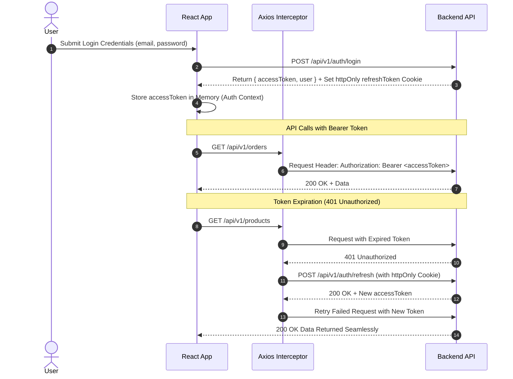
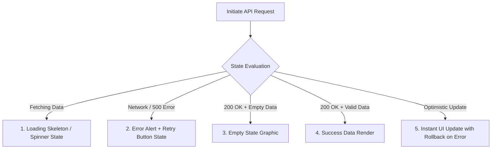

# 10. Backend Integration & API Contracts

This document specifies the complete RESTful API contract specifications, Data Transfer Objects (DTOs), Zod schemas, and JWT authentication flows required to integrate the ROFOOF frontend with a backend service.

---

## 1. Authentication & JWT Refresh Token Flow



---

## 2. API Endpoints Catalog & DTO Specifications

### 2.1 Authentication Endpoints

#### `POST /api/v1/auth/login`
- **Request DTO (`LoginPayload`)**:
  ```typescript
  export interface LoginPayload {
    email: string;      // Valid email format
    password: string;   // Min 6 characters
    rememberMe?: boolean;
  }
  ```
- **Response DTO (`AuthResponse`)**:
  ```typescript
  export interface AuthResponse {
    accessToken: string;
    expiresIn: number; // Seconds
    user: {
      id: string;
      name: string;
      email: string;
      role: 'SUPER_ADMIN' | 'STORE_MANAGER' | 'DISPATCHER';
      avatarUrl?: string;
    };
  }
  ```

---

### 2.2 Orders Management Endpoints

#### `GET /api/v1/orders`
- **Query Parameters**: `page`, `limit`, `status` (`ALL` | `ACTIVE` | `PENDING` | `DELIVERED` | `CANCELLED`), `search`, `sortBy`.
- **Response DTO (`PaginatedOrdersResponse`)**:
  ```typescript
  export interface OrderItemDTO {
    id: string;
    productId: string;
    productName: string;
    quantity: number;
    unitPrice: number;
    totalPrice: number;
  }

  export interface OrderDTO {
    id: string; // e.g. "ORD-9482"
    customerName: string;
    customerPhone: string;
    deliveryAddress: string;
    totalAmount: number;
    paymentStatus: 'PAID' | 'PENDING' | 'REFUNDED';
    orderStatus: 'PENDING' | 'PROCESSING' | 'DISPATCHED' | 'DELIVERED' | 'CANCELLED';
    createdAt: string; // ISO Timestamp
    items: OrderItemDTO[];
    driverId?: string;
    driverName?: string;
  }

  export interface PaginatedOrdersResponse {
    data: OrderDTO[];
    total: number;
    page: number;
    totalPages: number;
  }
  ```

#### `POST /api/v1/orders` (Create Order)
- **Request DTO (`CreateOrderPayload`)**:
  ```typescript
  export interface CreateOrderPayload {
    customerId: string;
    deliveryAddress: string;
    items: { productId: string; quantity: number }[];
    notes?: string;
    paymentMethod: 'CASH_ON_DELIVERY' | 'CREDIT_CARD' | 'B2B_CREDIT';
  }
  ```

#### `PATCH /api/v1/orders/:id/status` (Update Status)
- **Request DTO**: `{ status: OrderStatus; driverId?: string }`

---

### 2.3 Product Catalog Endpoints

#### `GET /api/v1/products`
- **Query Parameters**: `page`, `limit`, `categoryId`, `search`, `status` (`ACTIVE` | `INACTIVE` | `LOW_STOCK`).
- **Response DTO (`PaginatedProductsResponse`)**:
  ```typescript
  export interface ProductDTO {
    id: string;
    name: string;
    sku: string;
    description: string;
    categoryId: string;
    categoryName: string;
    brand: string;
    retailPrice: number;
    wholesalePrice: number;
    stockCount: number;
    minStockThreshold: number;
    images: string[];
    isVisible: boolean;
    createdAt: string;
  }
  ```

#### `POST /api/v1/products` (5-Step Product Creation Payload)
- **Request DTO (`CreateProductPayload`)**:
  ```typescript
  export interface CreateProductPayload {
    name: string;
    description?: string;
    categoryId: string;
    brand?: string;
    isVisible: boolean;
    images: string[];
    weight: number;
    unit: 'KG' | 'L' | 'PIECE' | 'PACK';
    stockCount: number;
    minStockAlert: number;
    retailPrice: number;
    wholesalePrice: number;
    b2bMinQuantity: number;
  }
  ```

---

### 2.4 Driver & Fleet Endpoints

#### `GET /api/v1/drivers`
- **Response DTO**: `DriverDTO[]`
  ```typescript
  export interface DriverDTO {
    id: string;
    name: string;
    phone: string;
    vehicleType: 'VAN' | 'MOTORCYCLE' | 'TRUCK';
    licensePlate: string;
    status: 'ONLINE' | 'BUSY' | 'OFFLINE';
    currentLocation?: { lat: number; lng: number };
    totalDeliveries: number;
    rating: number;
  }
  ```

#### `POST /api/v1/dispatch/assign`
- **Request DTO**: `{ orderId: string; driverId: string }`

---

## 3. UI State Lifecycle Machine

Every TanStack Query data request must implement five standardized UI states:


