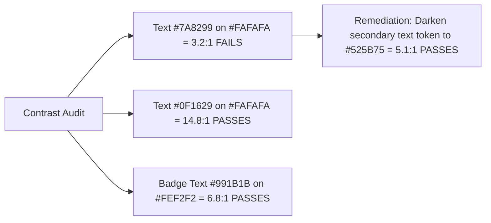

# 11. Accessibility Audit (WCAG 2.1 AA)

This document provides a comprehensive accessibility (a11y) evaluation of the current ROFOOF web application, highlighting WCAG 2.1 Level AA compliance gaps and remediation plans.

---

## 1. Compliance Audit Summary

| Accessibility Domain | Current Compliance | Status | Major Defects Found |
|---|---|---|---|
| **Semantic HTML** | 40% | ❌ NON-COMPLIANT | Widespread use of `div` and `span` with `onclick` handlers instead of semantic `button` or `a` tags. |
| **Keyboard Navigation** | 30% | ❌ NON-COMPLIANT | Modals do not trap focus; pressing `Tab` navigates behind the active modal overlay. |
| **ARIA Attributes** | 15% | ❌ NON-COMPLIANT | Missing `aria-expanded`, `aria-controls`, `aria-modal`, `role="dialog"`, `role="status"`. |
| **Focus States** | 50% | ⚠️ PARTIAL | Default browser focus outline removed via `outline: none` without adding high-contrast custom ring. |
| **Color Contrast** | 70% | ⚠️ PARTIAL | Light gray secondary text `#7A8299` on `#FAFAFA` falls below the 4.5:1 ratio threshold (3.2:1). |
| **Screen Reader Support** | 20% | ❌ NON-COMPLIANT | Dynamic data table updates (`js/app.js`, `js/orders.js`) provide no `aria-live` notifications. |
| **Alt Tags** | 40% | ⚠️ PARTIAL | Logo images have generic alt tags (`alt="Rofof"`), icons missing `aria-hidden="true"`. |

---

## 2. Key Defect Remediation Specifications

### 2.1 Non-Semantic Clickable Elements
- **Defect**: In `layout.js`, sidebar sub-menu items and modal openers are defined as:
  ```html
  <div class="sb-action" onclick="openAddProductModal()">...</div>
  ```
- **Risk**: Keyboard users using `Tab` cannot focus or trigger these controls with `Enter` or `Space`.
- **Remediation**:
  ```tsx
  <button 
    type="button"
    className="sb-action" 
    onClick={openAddProductModal}
    aria-label="Add New Product"
  >
    <Package className="w-4 h-4" aria-hidden="true" />
    <span>Add Product</span>
  </button>
  ```

---

### 2.2 Modal Focus Trapping & Keyboard ESC Dismissal
- **Defect**: When `#addProductModal` opens, focus remains on the triggering element in the sidebar. Keyboard users can tab into background controls.
- **Remediation**: Use Radix UI Dialog primitives (`@radix-ui/react-dialog`) which automatically:
  1. Trap focus within the dialog container.
  2. Restore focus to the trigger element on close.
  3. Close on pressing `Escape`.
  4. Inject `role="dialog"`, `aria-modal="true"`, `aria-labelledby`, and `aria-describedby`.

---

### 2.3 Color Contrast Ratios (WCAG 2.1 AA Threshold: 4.5:1)



---

### 2.4 Dynamic Live Region Notifications
- **Defect**: When orders or driver statuses update dynamically via JavaScript timers, screen reader users receive zero audio notifications.
- **Remediation**: Add an `aria-live` region for real-time announcements:
  ```tsx
  <div className="sr-only" aria-live="polite" aria-atomic="true">
    {latestNotificationMessage}
  </div>
  ```
