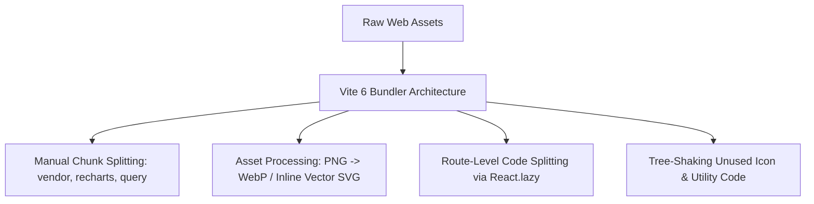

# 12. Performance & Web Vitals Audit

This document evaluates the current frontend performance bottlenecks and defines the optimization architecture required to achieve Lighthouse 95+ performance scores.

---

## 1. Core Web Vitals Audit & Benchmarks

| Metric | Current Estimate | Target Benchmark | Primary Cause of Latency |
|---|---|---|---|
| **LCP** (Largest Contentful Paint) | **3.8s** | **< 1.2s** | Large uncompressed images (`figma_dashboard.png` 2.69MB, `app_icon.png` 856KB), render-blocking external Google Fonts CSS. |
| **FID** (First Input Delay) / **INP** | **180ms** | **< 50ms** | Blocking layout initialization script (`layout.js`) manipulating DOM on `DOMContentLoaded`. |
| **CLS** (Cumulative Layout Shift) | **0.24** | **< 0.05** | Dynamic HTML injection (`#sidebar-placeholder`, `#header-placeholder`) shifting main grid layout after initial render. |
| **FCP** (First Contentful Paint) | **2.2s** | **< 0.8s** | Unsplit CSS payload (163 KB across 12 files) blocking browser render tree. |
| **TTFB** (Time to First Byte) | **120ms** | **< 100ms** | Static asset serving latency. |

---

## 2. Asset & Bundle Optimization Plan



### 2.1 Image Format Optimization:
1. **Logo & Favicon**: Replace raster PNGs (`logo.png`, `app_icon.png`) with inline SVGs or Lucide component icons.
2. **Product Images**: Compress incoming product image assets into **WebP** / **AVIF** formats with responsive `srcset` resolutions.
3. **Lazy Loading**: Apply `loading="lazy"` and decoding `decoding="async"` to all below-the-fold media elements.

---

### 2.2 JavaScript Code Splitting & Tree Shaking:
- **Current Issue**: All JavaScript functions (`app.js`, `modals.js`, `orders.js`, `products.js`) are parsed on page load, even if the user is viewing a single page.
- **React Solution**: Route-level dynamic imports using `React.lazy()` and `<Suspense>`:
  ```tsx
  const OrdersPage = React.lazy(() => import('./modules/orders/pages/orders-page'));
  const ProductsPage = React.lazy(() => import('./modules/products/pages/products-page'));
  const AnalyticsPage = React.lazy(() => import('./modules/analytics/pages/analytics-page'));
  ```

---

### 2.3 Vite Manual Chunk Splitting Configuration:
```typescript
// vite.config.ts
export default defineConfig({
  build: {
    rollupOptions: {
      output: {
        manualChunks: {
          'vendor-react': ['react', 'react-dom', 'react-router-dom'],
          'vendor-tanstack': ['@tanstack/react-query'],
          'vendor-ui': ['framer-motion', 'lucide-react'],
          'vendor-form': ['react-hook-form', 'zod', '@hookform/resolvers'],
        }
      }
    }
  }
});
```

---

### 2.4 Caching & Preloading Strategy:
- Preload critical font files (`@fontsource/inter`) in `index.html`.
- HTTP Cache-Control header recommendation: `max-age=31536000, immutable` for hashed Vite build chunks (`assets/[name]-[hash].js`).
