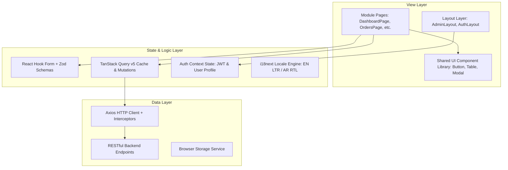

# 14. Target Frontend Architecture

This document specifies the enterprise target architecture for the ROFOOF frontend application, leveraging **React 19**, **TypeScript**, **Vite**, **TanStack Query v5**, **React Router v6/v7**, **Tailwind CSS v4**, **React Hook Form + Zod**, **i18next**, **Framer Motion**, and **Lucide React**.

---

## 1. Modular Directory Structure

```
src/
├── app/
│   ├── layouts/
│   │   ├── admin-layout.tsx
│   │   ├── auth-layout.tsx
│   │   └── root-layout.tsx
│   ├── providers/
│   │   ├── app-provider.tsx
│   │   ├── auth-provider.tsx
│   │   ├── query-provider.tsx
│   │   └── theme-provider.tsx
│   └── router/
│       ├── app-router.tsx
│       ├── protected-route.tsx
│       └── routes.config.ts
├── core/
│   ├── api/
│   │   ├── api-client.ts
│   │   ├── api-endpoints.ts
│   │   └── interceptors.ts
│   ├── config/
│   │   └── env.config.ts
│   ├── constants/
│   │   ├── app.constants.ts
│   │   └── storage.constants.ts
│   ├── helpers/
│   │   ├── date-formatter.ts
│   │   └── currency-formatter.ts
│   ├── hooks/
│   │   ├── use-debounce.ts
│   │   ├── use-local-storage.ts
│   │   └── use-media-query.ts
│   ├── services/
│   │   └── storage.service.ts
│   ├── types/
│   │   ├── api.types.ts
│   │   └── common.types.ts
│   └── utils/
│       ├── cn.ts
│       └── error-handler.ts
├── shared/
│   ├── assets/
│   ├── components/
│   │   ├── data-display/
│   │   │   ├── data-table.tsx
│   │   │   └── pagination.tsx
│   │   ├── feedback/
│   │   │   ├── empty-state.tsx
│   │   │   ├── skeleton.tsx
│   │   │   └── toast.tsx
│   │   ├── forms/
│   │   │   ├── form-field.tsx
│   │   │   └── form-select.tsx
│   │   ├── layout/
│   │   │   ├── container.tsx
│   │   │   └── page-header.tsx
│   │   ├── navigation/
│   │   │   ├── header.tsx
│   │   │   ├── language-switcher.tsx
│   │   │   └── sidebar.tsx
│   │   └── ui/
│   │       ├── avatar.tsx
│   │       ├── badge.tsx
│   │       ├── button.tsx
│   │       ├── card.tsx
│   │       ├── drawer.tsx
│   │       ├── input.tsx
│   │       ├── modal.tsx
│   │       ├── select.tsx
│   │       ├── switch.tsx
│   │       └── tabs.tsx
│   ├── constants/
│   ├── hooks/
│   │   └── use-disclosure.ts
│   ├── icons/
│   ├── lib/
│   │   └── tailwind.ts
│   └── styles/
│       ├── globals.css
│       └── tokens.css
├── modules/
│   ├── auth/
│   │   ├── api/
│   │   │   └── auth.api.ts
│   │   ├── components/
│   │   │   └── login-form.tsx
│   │   ├── hooks/
│   │   │   └── use-login-mutation.ts
│   │   ├── pages/
│   │   │   └── login-page.tsx
│   │   ├── types/
│   │   │   └── auth.types.ts
│   │   └── validation/
│   │       └── login.schema.ts
│   ├── dashboard/
│   │   ├── api/
│   │   ├── components/
│   │   │   ├── mini-stat-grid.tsx
│   │   │   ├── recent-orders-card.tsx
│   │   │   └── stat-card-grid.tsx
│   │   ├── pages/
│   │   │   └── dashboard-page.tsx
│   │   └── types/
│   ├── orders/
│   │   ├── api/
│   │   ├── components/
│   │   ├── hooks/
│   │   ├── pages/
│   │   │   └── orders-page.tsx
│   │   ├── types/
│   │   └── validation/
│   ├── products/
│   │   ├── api/
│   │   ├── components/
│   │   │   └── product-wizard/
│   │   ├── hooks/
│   │   ├── pages/
│   │   │   ├── categories-page.tsx
│   │   │   └── products-page.tsx
│   │   └── types/
│   ├── inventory/
│   │   └── pages/
│   │       └── stock-overview-page.tsx
│   ├── customers/
│   │   └── pages/
│   │       └── customers-page.tsx
│   ├── drivers/
│   │   └── pages/
│   │       ├── drivers-page.tsx
│   │       └── live-tracking-page.tsx
│   ├── dispatch/
│   │   └── pages/
│   │       └── dispatch-board-page.tsx
│   ├── analytics/
│   │   └── pages/
│   │       └── analytics-page.tsx
│   └── settings/
│       └── pages/
│           └── settings-page.tsx
├── localization/
│   ├── locales/
│   │   ├── ar/
│   │   └── en/
│   └── i18n.ts
├── theme/
│   ├── breakpoints.ts
│   ├── colors.ts
│   ├── shadows.ts
│   ├── spacing.ts
│   └── typography.ts
├── routes/
│   └── index.tsx
├── App.tsx
└── main.tsx
```

---

## 2. Layered System Architecture (Mermaid)



---

## 3. Technology Stack & Packages

| Layer | Recommended Library | Version | Purpose |
|---|---|---|---|
| **Core Framework** | React | `^19.0.0` | UI Library |
| **Language** | TypeScript | `^5.6.0` | Static Typing |
| **Build Tool** | Vite | `^6.0.0` | Ultra-fast HMR and bundling |
| **Routing** | React Router | `^7.0.0` | Client-side Routing |
| **Data Fetching** | TanStack Query | `^5.60.0` | Server State Management & Caching |
| **HTTP Client** | Axios | `^1.7.0` | REST API Client with Interceptors |
| **Form Handling** | React Hook Form | `^7.53.0` | Performant Uncontrolled Forms |
| **Validation** | Zod | `^3.23.0` | Type-safe Schema Validation |
| **Styling** | Tailwind CSS + `@tailwindcss/vite` | `^4.0.0` | Utility CSS & Design System Tokens |
| **Icons** | Lucide React | `^0.460.0` | Tree-shakable SVG Icons |
| **Animations** | Framer Motion | `^11.11.0` | Smooth Micro-animations & Layout Transitions |
| **Localization** | i18next + react-i18next | `^24.0.0` | Internationalization & RTL Support |
| **Code Quality** | ESLint + Prettier + Husky | Latest | Code Standards & Pre-commit Hooks |

---

## 4. Package Initialization Script (`package.json`)

```json
{
  "name": "rofoof-dashboard",
  "private": true,
  "version": "1.0.0",
  "type": "module",
  "scripts": {
    "dev": "vite",
    "build": "tsc && vite build",
    "preview": "vite preview",
    "lint": "eslint . --ext ts,tsx --report-unused-disable-directives --max-warnings 0",
    "format": "prettier --write \"src/**/*.{ts,tsx,css,json}\"",
    "prepare": "husky install"
  },
  "dependencies": {
    "@hookform/resolvers": "^3.9.0",
    "@tanstack/react-query": "^5.60.0",
    "axios": "^1.7.7",
    "clsx": "^2.1.1",
    "framer-motion": "^11.11.17",
    "i18next": "^24.0.0",
    "i18next-browser-languagedetector": "^8.0.0",
    "lucide-react": "^0.460.0",
    "react": "^19.0.0",
    "react-dom": "^19.0.0",
    "react-hook-form": "^7.53.2",
    "react-i18next": "^15.1.1",
    "react-router-dom": "^7.0.0",
    "tailwind-merge": "^2.5.4",
    "zod": "^3.23.8"
  },
  "devDependencies": {
    "@tailwindcss/vite": "^4.0.0",
    "@types/node": "^22.9.0",
    "@types/react": "^19.0.0",
    "@types/react-dom": "^19.0.0",
    "@vitejs/plugin-react": "^4.3.3",
    "autoprefixer": "^10.4.20",
    "eslint": "^9.15.0",
    "husky": "^9.1.6",
    "lint-staged": "^15.2.10",
    "postcss": "^8.4.49",
    "prettier": "^3.3.3",
    "tailwindcss": "^4.0.0",
    "typescript": "^5.6.3",
    "vite": "^6.0.0"
  }
}
```
