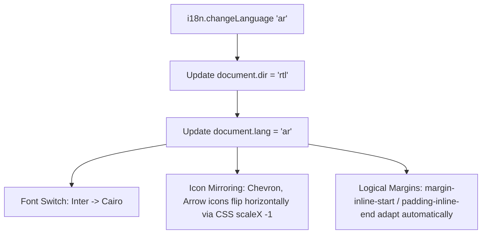

# Localization & Internationalization (i18n / RTL) Audit

This document provides a comprehensive audit of string extraction, key mappings, and RTL (Arabic) rendering behavior across the ROFOOF application.

---

## 1. Extracted Translation Key Mapping Catalog

### 1.1 Navigation Keys (`nav.json`)
- `nav.dashboard` -> "Dashboard" / "لوحة التحكم"
- `nav.orders` -> "Orders" / "الطلبات"
- `nav.allOrders` -> "All Orders" / "جميع الطلبات"
- `nav.activeOrders` -> "Active Orders" / "الطلبات النشطة"
- `nav.pending` -> "Pending" / "قيد الانتظار"
- `nav.delivered` -> "Delivered" / "تم التوصيل"
- `nav.cancelled` -> "Cancelled" / "ملغاة"
- `nav.products` -> "Products" / "المنتجات"
- `nav.productList` -> "Product List" / "قائمة المنتجات"
- `nav.categories` -> "Categories" / "الفئات"
- `nav.inventory` -> "Inventory" / "المخزون"
- `nav.stockOverview` -> "Stock Overview" / "نظرة عامة على المخزون"
- `nav.lowStock` -> "Low Stock" / "مخزون منخفض"
- `nav.outOfStock` -> "Out of Stock" / "نفذت الكمية"
- `nav.customers` -> "Customers" / "العملاء"
- `nav.customerAccounts` -> "Customer Accounts" / "حسابات العملاء"
- `nav.drivers` -> "Drivers" / "السائقين"
- `nav.driverFleet` -> "Driver Fleet" / "أسطول السائقين"
- `nav.liveTracking` -> "Live Tracking" / "التتبع المباشر"
- `nav.dispatch` -> "Dispatch" / "التوزيع"
- `nav.dispatchBoard` -> "Dispatch Board" / "لوحة التوزيع"
- `nav.analytics` -> "Analytics" / "التحليلات"
- `nav.settings` -> "Settings" / "الإعدادات"

---

## 2. RTL Layout & Directional Mirroring Rules

### 2.1 Currency & Date Formatter Utilities:
- **Currency**: `Intl.NumberFormat('ar-SA', { style: 'currency', currency: 'SAR' }).format(2840.50)` $\rightarrow$ `٢,٨٤٠.٥٠ ر.س`
- **Dates**: `Intl.DateTimeFormat('ar-SA', { dateStyle: 'medium' }).format(new Date())`
